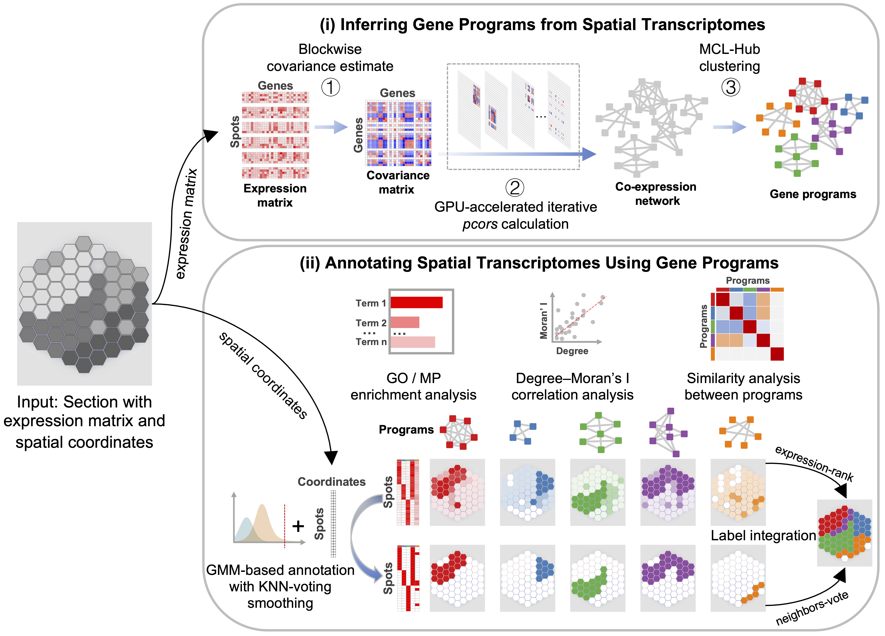

# SpacGPA: Spatial and single-cell Gene Program Analysis

**SpacGPA** is a GPU-accelerated toolkit that annotates spatial transcriptomes through de novo interpretable gene programs. It builds co-expression networks via a **Gaussian graphical model (GGM)**, identifies programs with a **modified Markov Clustering (MCL)** algorithm, performs ontology-based enrichment (Gene Ontology (GO) / Mammalian Phenotype (MP)), and applies programs to spatial analyses such as detection of SVGs, spatial domain annotation, and label integration.

  

SpacGPA is described in the preprint “[SpacGPA: annotating spatial transcriptomes through de novo interpretable gene programs](https://doi.org/10.1101/2025.10.01.679918)” (Xu, Chen, Ma) and is released under the BSD-3-ClausW license.

## Highlights

- **Network inference:** Fast gene–gene co-expression via GGM with GPU-friendly blockwise operations.
- **Program discovery:** Interpretable gene programs from a modified **MCL** with minimal tuning.
- **Functional interpretation:** **GO/MP** enrichment and hub genes-weighted program scoring.
- **Spatial analysis:** SVGs detection, domain annotation, and label integration.
- **Scalability & transferability:** Handles million-spot datasets; programs transfer across sections, platforms, and single-cell datasets.

## Installation

### Option A — Quick Installation

**Before installation, Download the full repository** via clone `https://github.com/MaShisongLab/SpacGPA.git` and `cd` into it, or click **Code → Download ZIP** and unzip.  

1) Make sure you have installed CUDA-enabled PyTorch for GPU support (skip this step if using CPU only).

2) Install SpacGPA  
**cd SpacGPA-main**  
**pip install -e .**  

### Option B — Create a conda environment

1) Create the environment  
**cd SpacGPA-main**  
**conda env create -f environment.yml**  
**conda activate SpacGPA**  

2) Install SpacGPA  
**pip install -e .**  
**conda deactivate**  

**Note:** If you prefer a different CUDA/toolkit, edit the PyTorch lines in environment.yml
to match your GPU / driver before installation. See [PyTorch](https://pytorch.org/get-started/locally/)
for a suitable version build for your CUDA/CPU. Option B provides a conservative working environment; try replacing the software in environment.yml with a newer version if you expect faster computations.

## Usage

 • See the documentation and tutorials in [SpacGPA](https://spacgpa.readthedocs.io).  
 • Each tutorial covers a typical workflow: network construction → program identification → functional enrichment analysis of programs → spatial transcriptome annotation using programs → visualization.

## How to cite

If you use SpacGPA in your work, please cite:
Xu Y, Chen L, Ma S. SpacGPA: annotating spatial transcriptomes through de novo interpretable gene programs. bioRxiv (2025). doi:10.1101/2025.10.01.679918.    

## License

This project is released under the BSD-3-Clause license. See the LICENSE file for details.

## Contact

For questions and feature requests, please open an issue on GitHub or contact the corresponding author (<sma@ustc.edu.cn>).
